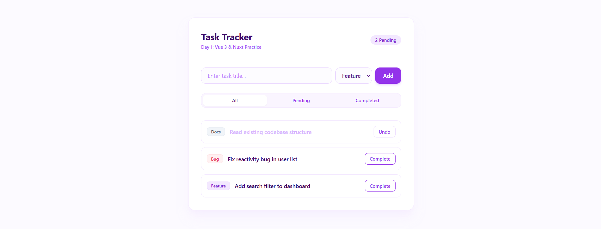

# Nuxt 3 & Vue 3 Task Tracker

A modern, component-driven task management application built with **Nuxt 3**, **Vue 3 (Composition API)**, **TypeScript**, and **Tailwind CSS**. Built as part of a structured practice workflow focused on frontend architectural patterns, state management, and type safety.

## UI Preview



---

## Features & Architecture

* **Vue 3 Composition API:** Uses `<script setup lang="ts">` with `ref`, `computed`, and strict type definitions.
* **Component-Driven Design:** Decoupled `TaskCard.vue` UI component driven by `defineProps` and `defineEmits` contracts.
* **Nuxt 3 Auto-Imports:** Takes advantage of Nuxt's auto-import engine for composables and component resolution.
* **Separation of Concerns:** Shared interface contracts isolated inside standard `types/task.ts` definition files to avoid cross-component coupling.
* **Tailwind Styling:** Clean, light purple themed UI styled with modern utility classes.

---

## Tech Stack

* **Framework:** [Nuxt 3](https://nuxt.com/)
* **Library:** [Vue 3](https://vuejs.org/)
* **Language:** [TypeScript](https://www.typescriptlang.org/)
* **Styling:** [Tailwind CSS](https://tailwindcss.com/)

---

## Getting Started

### 1. Prerequisites

Ensure you have **Node.js** (v18.x or later) installed.

### 2. Installation

Clone the repository and install dependencies:

```bash
# Clone the repository
git clone [https://github.com/DashDaSmash/day1-vue-practice.git](https://github.com/DashDaSmash/day1-vue-practice.git)

# Navigate into project directory
cd day1-vue-practice

# Install dependencies
npm install